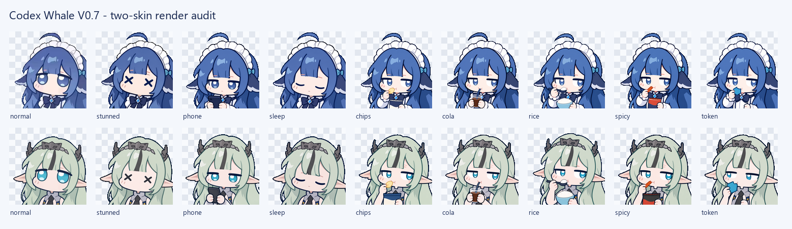

# Codex 小鲸鱼桌面挂件

一个面向 Windows 的轻量、个人级桌面挂件。它会以只读方式显示 Codex 的任务状态、额度和可用重置卡数量，并提供可点击、可拖拽、可甩出的桌宠交互。

> 当前版本：V0.7.0。该项目不是 Codex 原生 `/pets` 的换皮，也不是 OpenAI、DeepSeek 或《明日方舟：终末地》的官方项目。



## 主要功能

- 两套皮肤：`DeepSeek 小鲸鱼` 与 `终末地 · 祀（非官方同人）`，每套包含常态、撞晕和 7 张待机差分图。
- 5 分钟无互动后随机显示一张待机差分；再次互动即恢复常态。
- 点击压扁回弹、三级气泡动画、4 种音效和 5 档音量。
- 跟随鼠标、慢起步与后段加速、惯性滑行、边缘反弹和撞晕状态。
- 左键拖拽与甩出，松手后按最近轨迹计算惯性；物理引擎可独立关闭。
- 固定位置、绝对位置以及最多 3 个位置/大小预设。
- 50% 至 220% 比例缩放、窗口置顶和可选的当前用户开机自启动。
- 只读显示 Codex 任务状态、额度百分比及可用重置卡数量；不提供主动重置入口。
- 音频在后台有界队列中播放，图片在载入时降采样并预热，避免点击和撞墙时阻塞 Tk 主线程。

## 运行要求

- Windows 10 或 Windows 11。
- Python 3.12 或更高版本，并带有 `tkinter`。
- 已安装 Codex 桌面应用或可用的 `codex.exe`；若只想体验桌宠，Codex 数据不可用时界面会降级为未知状态。
- 日常运行不要求 Pillow；仓库已包含 152×152 的预生成显示缓存。只有重新构建皮肤缓存或运行完整素材验收时才需要 Pillow。

## 快速开始

1. 下载或克隆仓库。
2. 双击 `Start-CodexWhale.cmd`。
3. 右键桌宠打开设置菜单。

也可以直接运行：

```powershell
python .\codex_whale_v0.py
```

程序会在仓库目录旁创建本机 `settings-v0.1.json`。该文件包含窗口位置和个人偏好，已被 `.gitignore` 排除，不应提交。

## 隐私与权限边界

- 不修改 Codex 账号、任务、对话或远程状态。
- 不修改 Codex 原生 `/pets`。
- 额度通过 Codex App Server 的只读 `account/rateLimits/read` 获取。
- 任务状态通过 SQLite 只读连接和绑定的 rollout 生命周期事件判断；不读取提示词正文。
- 不保存 Cookie、凭据、额度原始响应或重置卡详情。
- 不自动联网、下载、安装、发布或上传数据。
- 开机自启动默认关闭；只有用户在菜单中主动开启时才写入当前 Windows 用户的启动项。

## 本地验证

```powershell
python .\codex_whale_v0.py --self-test
python .\codex_whale_v0.py --snapshot
python .\codex_whale_v0.py --qa-report
python .\codex_whale_v0.py --smoke-seconds 8
```

若本机同时安装了 Python 3.12、3.14 与 Pillow，可运行：

```powershell
python .\tools\validate_v0_7.py
```

验证工具会把本机报告写入被忽略的 `validation/` 目录。公开验收摘要见 [docs/VALIDATION.md](docs/VALIDATION.md)。

## 项目结构

```text
codex_whale_v0.py          主程序
Start-CodexWhale.cmd       Windows 双击入口
assets/                    皮肤、显示缓存与音效
tools/                     音效和显示缓存的可复现构建工具
docs/                      脱敏后的公开说明与预览
```

## 更新与卸载

“检查更新”只显示本机版本和项目地址，不会联网检查或自动安装。需要更新时请手动查看 GitHub 仓库。

卸载前先右键选择“退出程序”。如果曾开启开机自启动，请先在菜单中关闭，然后删除项目文件夹。

## 社区

本项目积极参与并认可 [LINUX DO](https://linux.do) 社区。

## 许可证与素材声明

- 本项目自行编写的源代码使用 [MIT License](LICENSE)。
- MeteorNOX 上游文件及其 MIT 文本见 [LICENSE-MeteorNOX.txt](LICENSE-MeteorNOX.txt) 和 [THIRD_PARTY_NOTICES.md](THIRD_PARTY_NOTICES.md)。
- 角色同人图、衍生图及其显示缓存不自动适用本项目代码的 MIT License。请在复制、再分发或商业使用前确认相应角色、商标和美术素材权利。详见 [ASSET_LICENSE.md](ASSET_LICENSE.md)。

欢迎提交问题和改进建议。请勿在 Issue、日志或截图中附带 Cookie、访问令牌、本机用户名、任务正文或其他个人信息。
